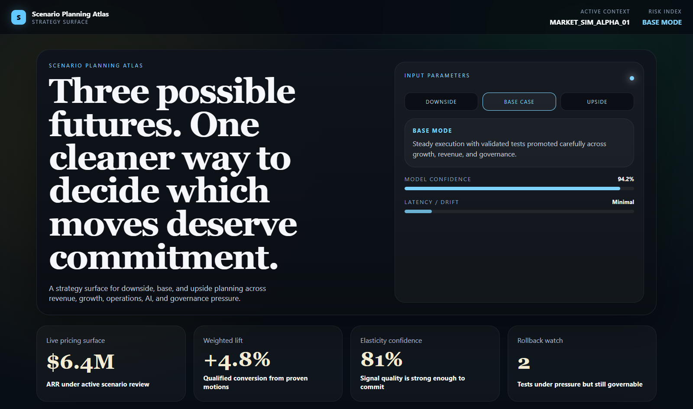
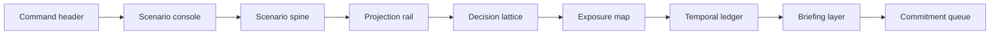
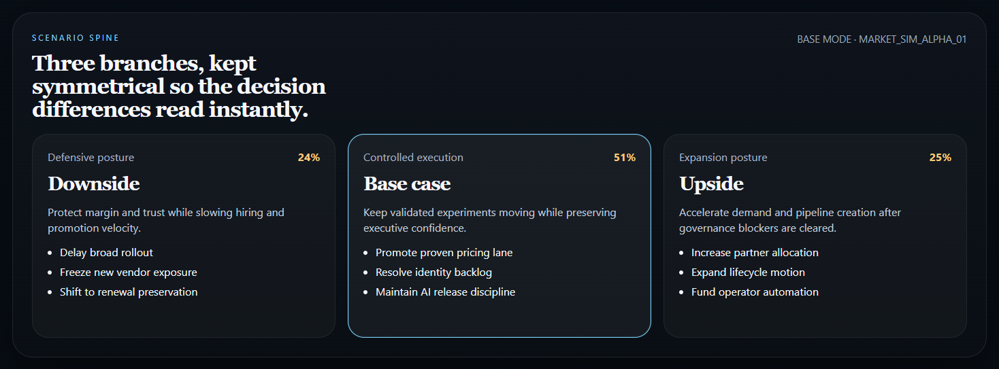
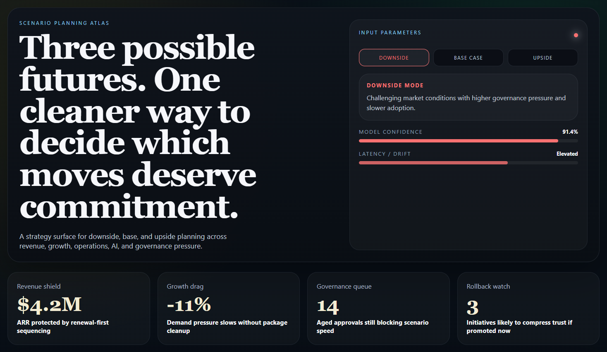
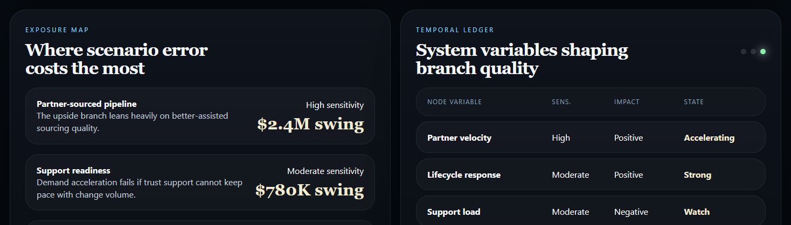
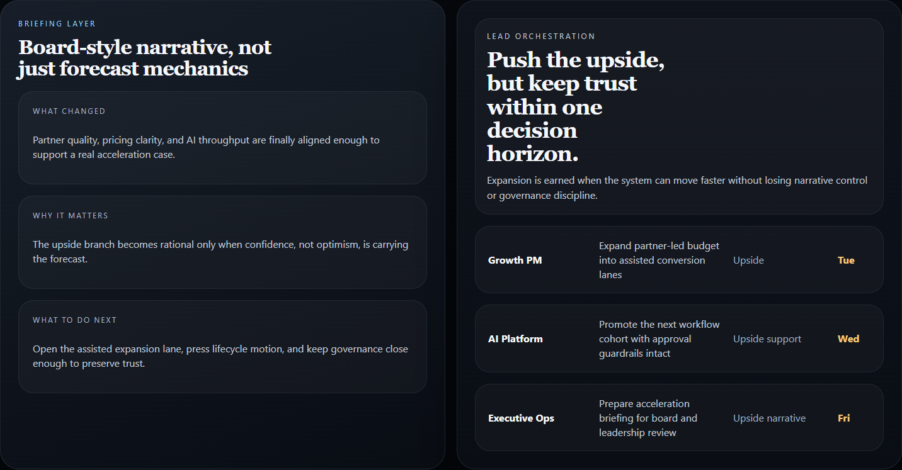

# Scenario Planning Atlas



## Executive Summary

Scenario Planning Atlas is a React + TypeScript strategy surface for comparing
downside, base-case, and upside operating paths. It is designed to make
scenario selection feel visual, deliberate, and executive-readable instead of
buried in spreadsheets or generic dashboards. The current version adds a
control-room layer with live scenario modes, projection rails, and a temporal
ledger so the planning surface feels operational instead of static.

## Why It Matters

This project shows:

- frontend product design beyond standard dashboard tropes
- strategy translation across revenue, growth, AI, operations, and governance
- a cleaner visual system for scenario comparison and decision consequence
- a stronger editorial layer for executive and operator communication

## Tech Stack

[](https://react.dev/)
[](https://vite.dev/)
[](https://www.typescriptlang.org/)
[](https://developer.mozilla.org/en-US/docs/Web/CSS)
[](https://vitest.dev/)
[](https://opensource.org/license/mit)

## Overview

| Area | What it shows |
| --- | --- |
| Command header | Active context, mode state, and risk framing before the user even reaches the planning canvas |
| Scenario console | Live downside / base / upside switching with confidence and drift meters |
| Scenario spine | Downside, base-case, and upside branches arranged with visual symmetry |
| Projection rail | Month-by-month scenario compounding with clearer branch momentum |
| Decision lattice | Strategy levers that change which branch becomes rational |
| Exposure map | Sensitivity zones where scenario error becomes expensive |
| Temporal ledger | A structured readout of the variables shaping branch quality |
| Briefing layer | Executive-facing narrative framing for what changed, why it matters, and what to do next |
| Commitment queue | Named owners and next moves attached to a specific branch |

## Architecture



## Screenshots

### Hero


### Scenario Spine


### Downside Mode


### Exposure and Ledger


### Briefing and Queue


## Setup

```powershell
cd scenario-planning-atlas
npm install
npm run dev
```

## Validation

```powershell
cd scenario-planning-atlas
npm test
npm run build
npm run lint
```

## Portfolio Links

- [Kinetic Gain](https://kineticgain.com/)
- [LinkedIn](https://www.linkedin.com/in/mirzacausevic)
- [Skills / Portfolio](https://mizcausevic.com/skills/)
- [Medium](https://medium.com/@mizcausevic)
- [GitHub](https://github.com/mizcausevic-dev)
