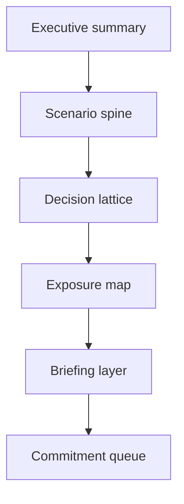

# Architecture

## Overview

Scenario Planning Atlas is a frontend-first strategy workspace. It is designed
to make scenario comparison feel structured and visual rather than
spreadsheet-heavy.

## Experience Model

## Intent

- make branch comparison obvious
- reduce visual clutter and dashboard sameness
- show product judgment through layout, hierarchy, and pacing
- reinforce the broader portfolio narrative around growth systems and decision surfaces

